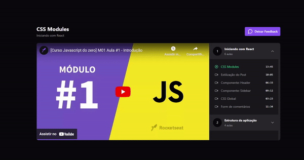

<h1 align="center">  
React Redux Zustand
</h1>

<div align="center">  
  
</div>

## Sobre

Aprendi sobre Redux e como gerenciar o estado em aplicações React. Configuração de reducers e actions, e como testar o código usando vitest. Além disso, tivemos um comparativo entre o Redux com o Zustand e entender as diferenças e vantagens de cada um. Curso prático e útil para dominar o Redux Toolkit e o React Redux.

## Tecnologias

React, Redux Toolkit, React Redux, Zustand, Vitest


### 🚀 Como executar

```bash
  git clone https://github.com/fbrcio/react-redux-zustand.git
  cd react-redux-zustand
```
Para iniciá-lo, siga os passos abaixo:

### 👾 Instalar as dependências

```bash
npm install
```

### 😎 Iniciar o projeto

```bash
npm run dev
```

### 💻 Iniciar o servidor (json-server)

```bash
npm run server
```